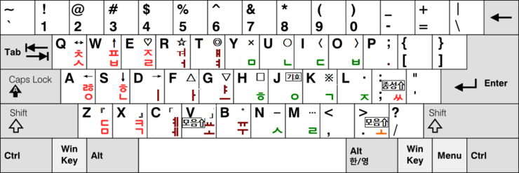
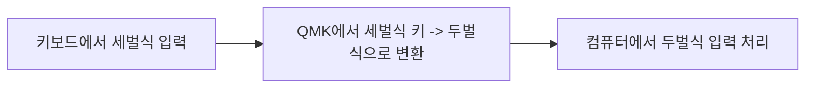

<center>
<h1>QMK 세벌식 모아치기 e 입력기</h1>
</center>

## 소개
### 세모이(세벌식 모아치기 e) 자판이란?

아래 이미지와 같은 배열을 가진 세벌식 자판입니다.



자세한 내용은 [신세기 연구소 - 세모이](https://blog.naver.com/eekdland/220526834927) 페이지를 참고해주세요

### QMK 세모이 입력기

일반적으로 키보드 한글 입력 처리는 컴퓨터 소프트웨어에서 처리하는 것이 일반적입니다.

하지만 세모이 자판의 경우 OS에 기본적으로 탑재되어 있지 않기에 외부 소프트웨어를 설치하고 설정하는 과정이 필요합니다.

QMK 세모이는 아래 흐름도와 같이, 기존 컴퓨터의 두벌식 입력기를 활용하여 세벌식 입력이 가능하도록 합니다.




## 설치 방법

> [!NOTE]  
> pro micro 호환 rp2040 보드, QMK `v0.23.2` 에서 테스트 되었습니다
>
> 메모리가 충분하지 않은 경우 정상적으로 작동하지 않을 수 있습니다


- `keymap.c` 파일이 있는 폴더에 `src/` 의 파일들을 복사합니다.
    - 예시
    ```
    keyboards/<your_keyboard>/keymaps/default
    ├── keymap.c
    ├── rules.mk
    ├── semoi.c
    ├── semoi.h
    ├── semoi_shortcuts.h
    ```

- rules.mk 파일에 semoi.c 파일을 추가합니다.
```makefile
# ...... 기존 코드

DEFERRED_EXEC_ENABLE = yes
SRC += semoi.c
```


- `keymap.c` 파일에 세벌식 모아치기 입력용 레이어를 추가합니다.
```c
const uint16_t PROGMEM keymaps[][MATRIX_ROWS][MATRIX_COLS] = {
// ......
  [LAYER_SEMOI] = LAYOUT_wrapper(HOME_ROW_MOD_GACS(
    KC_Q     , KC_W     , KC_E     , KC_R     , KC_T     ,                            KC_Y     , KC_U     , KC_I     , KC_O     , KC_P     ,
    KC_A     , KC_S     , KC_D     , KC_F     , KC_G     ,                            KC_H     , KC_J     , KC_K     , KC_L     , KC_SEMICOLON  ,
    KC_Z     , KC_X     , KC_C     , KC_V     , KC_B     ,                            KC_N     , KC_M     , KC_COMM  , DOT_SCRL   , KC_SLSH,
    ESC_MED, SPC_NAV, TAB_FUN, ENT_SYM, BSP_NUM
  )),
// ......
```

- `keymap.c` 파일의 `process_record_user`, `matrix_scan_user` 함수에 세모이 입력기 함수 호출을 추가합니다.
```c
#include "semoi.h"

// ......

bool process_record_user(uint16_t keycode, keyrecord_t *record) {
    if (layer_state_is(LAYER_SEMOI) && process_record_semoi(keycode, record)) {
        return false;
    }

    // 기존 코드
    return true;
}

void matrix_scan_user(void) {
    matrix_scan_semoi();
}
```

- (선택) 필요할 경우, 아래 [설정](#설정) 항목을 참고하여 설정을 변경합니다.

## 설정

| Define                          | Default | Description                                                      |
| ------------------------------- | ------- | ---------------------------------------------------------------- |
| #define SEMOI_SHORTCUTS_ENABLED | -       | 모아치기 약어 사용설정                                           |
| #define SEMOI_TIMEOUT_MS        | 300     | 최대 몇 ms 까지 상태를 유지할지 설정                             |
| #define SEMOI_DEFER_TIME        | 30      | 최대 몇 ms 까지 동시 입력/변환을 허용할지 설정                   |
| #define SEMOI_COMPLETE_COMPOSE  | -       | 모아치기시 ARROW_RIGHT를 자동으로 눌러 글자가 분해되는 문제 방지 |


## 참고 자료
- QMK 메크로 관련 : [getreuer.info](https://getreuer.info/posts/keyboards/triggers/index.html#based-on-previously-typed-keys)
- Semoi Karabiner 구동기 : [blog.naver.com/atlkitol](https://blog.naver.com/atlkitol/222300755286)
- [QMK Source Code](https://github.com/qmk/qmk_firmware/blob/master/quantum/process_keycode/process_combo.c)


